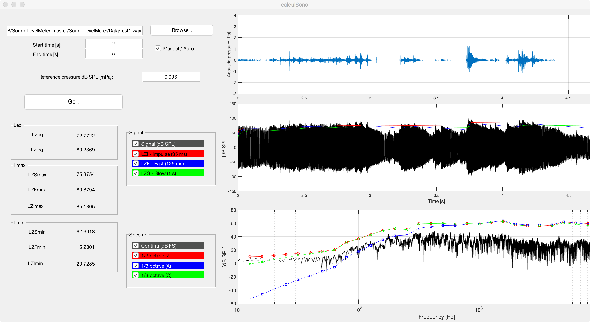

# SoundLevelMeter
Matlab GUI app that emulates a sound level meter for wav files.

v1.0 - 2013. Guilhem Mariotte

Basic features
--------------
- Equivalent, max and min sound pressure levels for the three time constant modes (Impulse, Fast and Slow) and the frequency Z-weighting
- Display of 1/3-octave band spectrum in A, C and Z-weighting
- Work with .WAV input files

Further extensions
------------------
- Sound pressure levels for the frequency A and C-weighting

Resources
---------
See the documentation (only in French for now) for more details about acoustics and the calculation of sound pressure levels.
